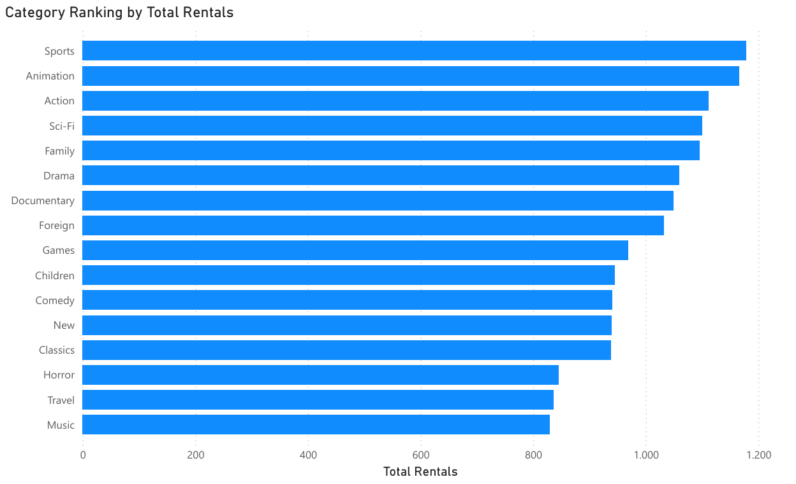
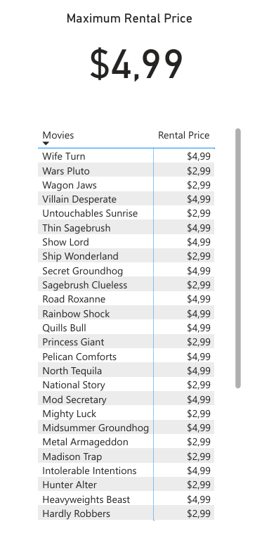

# Portafolio de Análisis SQL - Base de Datos Pagila

Este repositorio contiene tres casos de estudio que demuestran la habilidad para traducir preguntas de negocio a consultas SQL complejas y visualizaciones de Power BI.

---

## 📊 Case Study 1: Category Ranking by Total Rentals

### 1. The Business Question
**Objective:** To determine which movie category generates the highest number of rental events to prioritize inventory purchasing.

**Impact:** This result guides management in inventory optimization and purchasing strategy to maximize Return on Investment (ROI).

### 2. The Data Strategy (SQL)
A complex query using four JOINs was necessary to link the rental events with their categories:
* **Tables Joined:** `category` → `film_category` → `inventory` → `rental`.
* **Aggregation:** The `COUNT(rental_id)` function was used to sum all unique rental events.

### 3. The Source Code (SQL Query)
```sql
SELECT
    c.name AS category_name,
    COUNT(r.rental_id) AS total_rentals
FROM
    category AS c
JOIN film_category AS fc USING (category_id)
JOIN film AS f USING (film_id)
JOIN inventory AS i USING (film_id)
JOIN rental AS r USING (inventory_id)
GROUP BY
    c.name
ORDER BY
    total_rentals DESC;
```
**View the complete SQL Script:** [sql_scripts/category_largest_rentals.sql](./sql_scripts/category_largest_rentals.sql)

### 4. Conclusion and Visualization

**Conclusion**:
The analysis reveals that the Sports category is the top performer, indicating that the purchasing strategy should prioritize this genre. The overall performance of all categories is shown in the ranking below.

**Visualization**:
 

**Data Transparency**:
The complete ranking of all 16 categories used for this visualization is available for verification in the file [data/category_largest_rentals.csv](./data/category_largest_rentals.csv) accompanying this repository.


## 🔍 Case Study 2: Identifying High-Priced Documentary Movies

### 1. The Business Question
**Objective**: To identify and list all movies categorized as 'Documentary' that have a high rental rate (greater than or equal to $2.99).

**Impact**: This enables the marketing team to focus promotions on specific high-value content and confirms the current inventory strategy for premium documentaries.

### 2. The Data Strategy (SQL)
A complex query using three joins was necessary to link the film title, its category, and the rental rate.

* **Tables Joined**: film → film_category → category.

* **Filter**: A compound WHERE clause was used to apply both criteria: c.name='Documentary' AND f.rental_rate >= 2.99.

### 3. The Source Code (SQL Query)
```sql
SELECT
    f.title AS movies,
    c.name AS category,
    f.rental_rate AS rental_price
FROM
    film AS f
JOIN film_category AS fc USING (film_id)
JOIN category AS c USING (category_id)
WHERE
    c.name='Documentary' AND f.rental_rate >= 2.99
ORDER BY
    rental_price DESC;
```
**View the complete SQL Script:** [sql_scripts/movies_documentary_filter.sql](./sql_scripts/movies_documentary_filter.sql)

### 4. Conclusion and Visualization
**Conclusion**: The maximum rental rate for films in this filtered segment is $4.99. The visual confirms the precise list of high-value titles and highlights the uniformity of pricing within this category.

**Visualization**:



**Data Transparency**: The complete dataset, which includes the exact listing of all films that meet the criteria, is available for verification in the file [data/movies_documentary_filter.csv](./data/movies_documentary_filter.csv) accompanying this repository.

## 💰 Case Study 3: High-Value Customer Ranking by Total Spending

### 1. The Business Question
**Objective**: To identify customers who have spent more than $100 in total.

**Impact**: This enables the retention team to prioritize these "high-value customers" (HVCs) for exclusive loyalty programs and tailored offers.

### 2. The Data Strategy (SQL)
This analysis required aggregating payment data and applying a filter directly to that aggregated result:

* **Tables Joined**: customer → payment.

* **Aggregation**: The SUM(amount) function was used to calculate the total amount spent by each customer.

* **Filter on Aggregate**: The HAVING clause (HAVING SUM(amount) > 100) was used to filter the grouped results.

### 3. The Source Code (SQL Query)
```sql
SELECT
    c.first_name || ' ' || c.last_name AS full_name,
    SUM(amount) AS total_spent
FROM
    customer AS c
JOIN
    payment AS p USING (customer_id)
GROUP BY
    c.customer_id, full_name
HAVING
    SUM(amount) > 100
ORDER BY
    total_spent DESC;
```
View the complete SQL Script: sql_scripts/customers_high_value.sql

### Conclusion and Visualization

**Conclusion**:
The customer with the highest total spending is Karl Seal, with a total expenditure of $108.67. The analysis identifies 395 high-value customers, ranked by their total accumulated spending.

**Visualization**:

**Data Transparency**:
The complete list of all high-value customers identified in this analysis is available for verification in the file data/customers_high_value.csv accompanying this repository.
